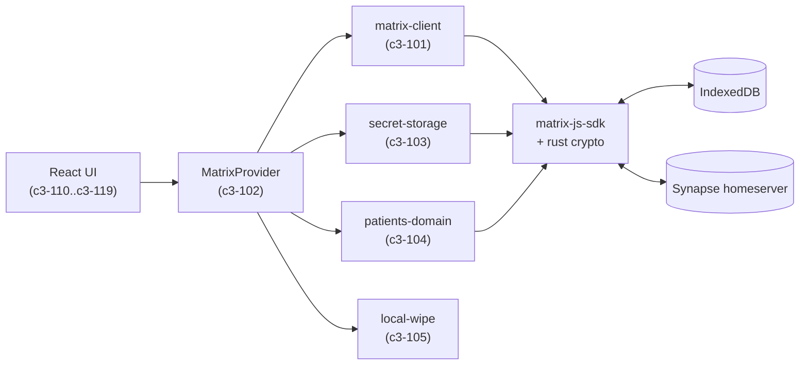
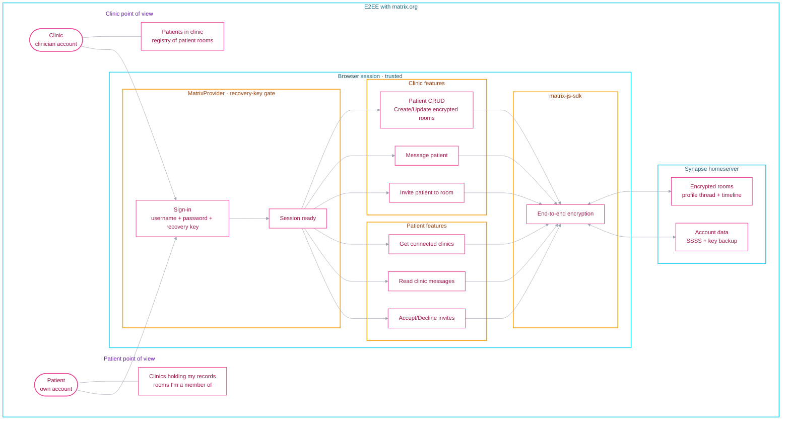

## Context

| Arg     | Value                                                                                                                                                                          |
| ------- | ------------------------------------------------------------------------------------------------------------------------------------------------------------------------------ |
| PROJECT | matrix (Matrix Patient Records)                                                                                                                                                |
| GOAL    | Store and share patient records over Matrix with end-to-end encryption and a fully-automatic key UX.                                                                           |
| SUMMARY | A browser-only Next.js app where each patient is a private encrypted Matrix room; clinics own a registry of patient rooms, patients see which clinics hold records about them. |

## Abstract Constraints

- All patient data is end-to-end encrypted; the homeserver never sees
  plaintext (Megolm + rust crypto via matrix-js-sdk).
- No feature is usable until the user has entered the correct recovery
  key in the current session (`AGENTS.md` rule).
- The recovery key is the only manual secret. No import/export,
  upload-backup, retry, or pull-backup buttons.
- Every patient record is one Matrix room; access control is room
  membership.
- All storage is browser-local (`localStorage` + `IndexedDB`); sign-out
  wipes it.
- No `window.confirm`/`alert`/`prompt`. Toasts via `sonner`, modals via
  shadcn `Dialog`.

## Containers

- c3-1 web — the Next.js client app (everything in `src/`).

External, not modelled as C3 containers:

- Synapse homeserver (dev-time in `docker/compose.yml`, prod is any
  Matrix homeserver).
- PostgreSQL (Synapse storage).

## Architecture Overview

## Flow Overview

