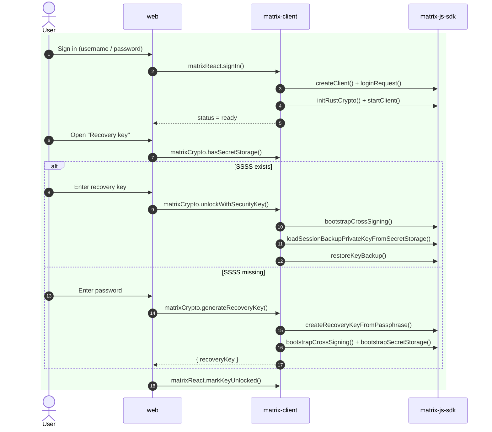
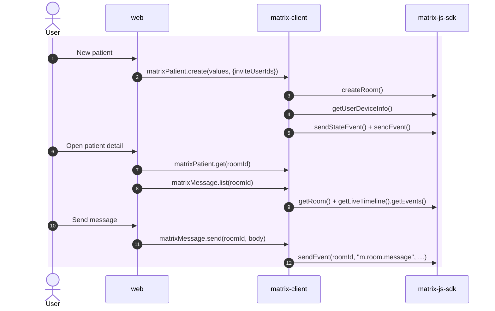
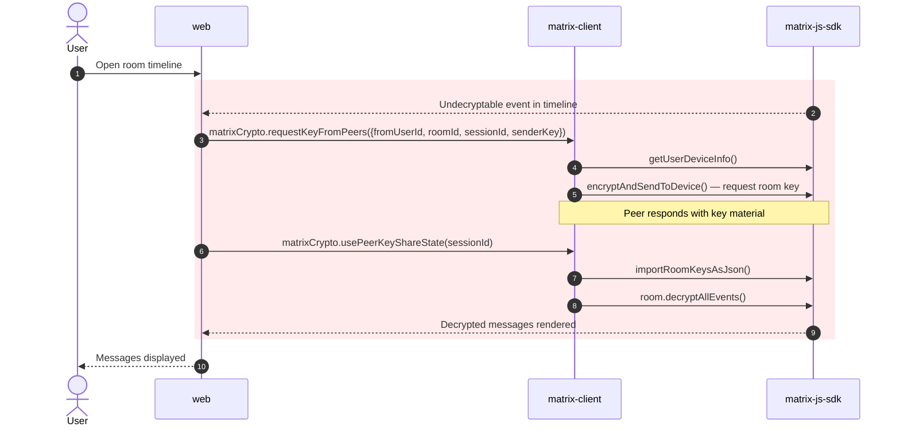

## Overview

How `web`, `matrix-client`, and `matrix-js-sdk` collaborate across the three core flows.

### 1. Authentication & Recovery Key

### 2. Patient Management

### 3. Handling Undecryptable Messages

