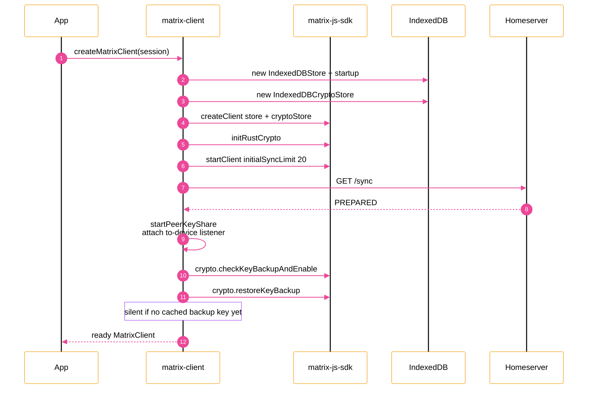
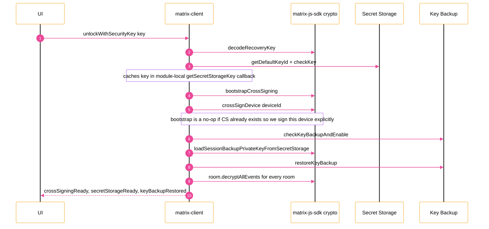

## Why does this exist?

## Bootstrap: how much code disappears



## Recovery-key unlock: one call, six SDK calls



## Install & usage

```tsx
import { MatrixProvider, useMatrix } from "matrix-client/react";
import { listPatients, createPatient } from "matrix-client/patients";

function App({ children }) {
  return <MatrixProvider>{children}</MatrixProvider>;
}

function PatientList() {
  const { client, ready } = useMatrix();
  if (!ready || !client) return null;
  const patients = listPatients(client);
  return (
    <ul>
      {patients.map((p) => (
        <li key={p.roomId}>{p.record.firstName}</li>
      ))}
    </ul>
  );
}
```
