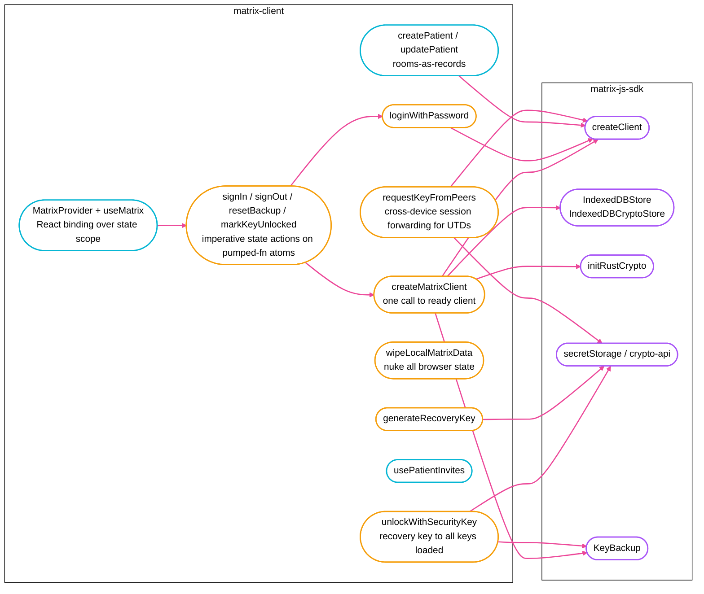
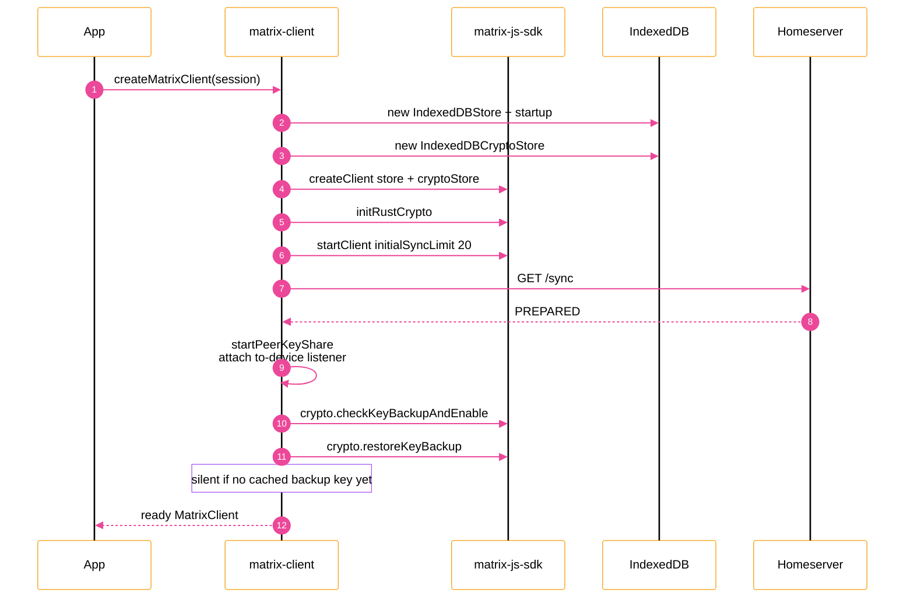
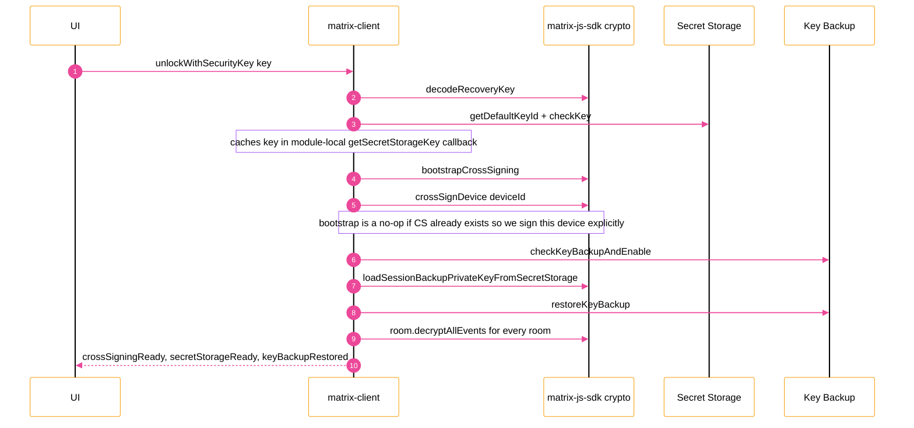
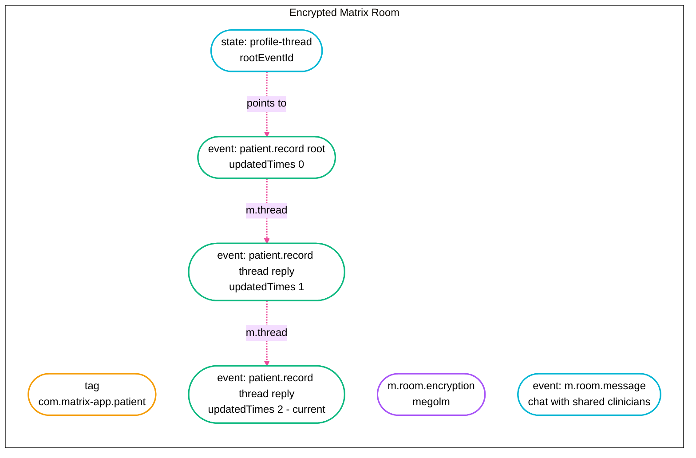
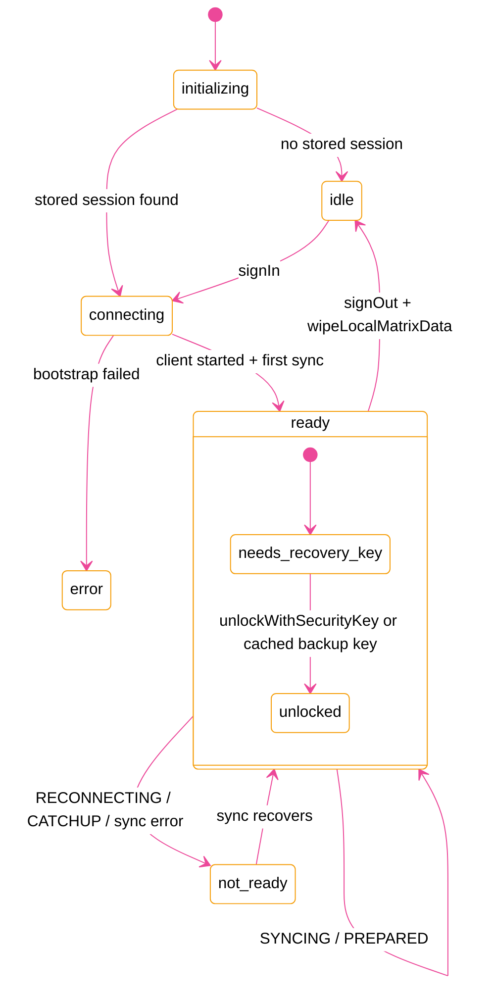

# matrix-client

## Why does this exist?

### What this package adds on top of `matrix-js-sdk`



## Bootstrap: how much code disappears



## Recovery-key unlock: one call, six SDK calls



Without this wrapper, forgetting just the `loadSessionBackupPrivateKeyFromSecretStorage()` step leaves the device with an active backup it cannot read — every old event surfaces as `HISTORICAL_MESSAGE_BACKUP_UNCONFIGURED`.

## Rooms-as-records pattern (patients)

Each patient is a **dedicated encrypted Matrix room**. The latest profile is the most recent custom event in the timeline; older revisions live as thread replies.



## React lifecycle (`MatrixProvider`)



## Install & usage

This package is currently consumed inside this monorepo only — see `web/` for live usage.

```tsx
import { MatrixProvider, useMatrix } from "matrix-client/react";
import { listPatients, createPatient } from "matrix-client/patients";

function App({ children }) {
  return <MatrixProvider>{children}</MatrixProvider>;
}

function PatientList() {
  const { client, ready } = useMatrix();
  if (!ready || !client) return null;
  const patients = listPatients(client);
  return (
    <ul>
      {patients.map((p) => (
        <li key={p.roomId}>{p.record.firstName}</li>
      ))}
    </ul>
  );
}
```
