## Architecture

```mermaid
sequenceDiagram
  autonumber
  participant App as Caller
  participant R as matrixReact
  participant A as state/actions
  participant T as state/atoms
  participant C as core
  participant SDK as matrix-js-sdk

  rect rgb(240, 248, 255)
  Note over App,SDK: Provider mount → bootstrap
  App->>R: <matrixReact.Provider/>
  R->>A: configureSessionStorageKey
  R->>A: primeMatrixState
  A->>T: scope.resolve(writableAtoms)
  A->>T: scope.resolve(readinessAtom)
  A-->>R: controllers ready
  R->>A: bootstrapMatrix
  A->>T: loadSession(storageKey)
  A->>A: start(session)
  A->>C: createMatrixClient
  C->>SDK: createClient
  C->>SDK: initRustCrypto
  C->>SDK: startClient + waitForPrepared
  C->>C: startPeerKeyShare
  C->>SDK: crypto.checkKeyBackupAndEnable
  C->>SDK: crypto.restoreKeyBackup
  A->>SDK: attachListeners (Sync, Crypto, HttpApi)
  SDK-->>A: ClientEvent.Sync / CryptoEvent.*
  A->>T: sync.set / crypto.set / lastSynced.set / pendingBackup.set
  T-->>R: useAtom() emits
  R-->>App: useMatrix() values
  end

  rect rgb(240, 255, 240)
  Note over App,SDK: matrixReact.signIn
  App->>R: signIn(input)
  R->>A: signIn
  A->>C: loginWithPassword
  C->>SDK: tmp.loginRequest(m.login.password)
  SDK-->>C: access_token + user_id + device_id
  A->>A: localStorage.setItem(session)
  A->>A: start(session)
  end

  rect rgb(255, 248, 240)
  Note over App,SDK: matrixReact.signOut
  App->>R: signOut
  R->>A: signOut
  A->>T: pendingBackup.get
  A->>A: teardownClient
  A->>SDK: client.logout / stopClient / clearStores
  A->>C: wipeLocalMatrixData
  C->>C: clearCachedSecurityKey
  A->>T: resetState
  end

  rect rgb(255, 240, 248)
  Note over App,SDK: matrixCrypto.generateRecoveryKey
  App->>C: generateRecoveryKey(client, {password})
  C->>SDK: crypto.createRecoveryKeyFromPassphrase
  C->>SDK: crypto.bootstrapCrossSigning (setupNew, UIA)
  C->>SDK: crypto.bootstrapSecretStorage (setupNewKeyBackup)
  C->>SDK: secretStorage.getDefaultKeyId
  C-->>App: { recoveryKey }
  end

  rect rgb(248, 240, 255)
  Note over App,SDK: matrixCrypto.unlockWithSecurityKey
  App->>C: unlockWithSecurityKey(client, recoveryKey)
  C->>C: cacheSecurityKey (decodeRecoveryKey + checkKey)
  C->>SDK: crypto.bootstrapCrossSigning
  C->>SDK: crypto.crossSignDevice(deviceId)
  C->>SDK: crypto.checkKeyBackupAndEnable
  C->>SDK: crypto.loadSessionBackupPrivateKeyFromSecretStorage
  C->>SDK: crypto.restoreKeyBackup
  C->>SDK: room.decryptAllEvents (∀ rooms)
  C-->>App: UnlockOutcome
  App->>R: markKeyUnlocked
  R->>T: keyUnlocked.set(true)
  T-->>R: readinessAtom recomputes
  end

  rect rgb(248, 255, 248)
  Note over App,SDK: matrixReact.resetBackup
  App->>R: resetBackup(recoveryKey)
  R->>A: resetBackup
  A->>C: cacheSecurityKey
  A->>SDK: crypto.resetKeyBackup
  A->>SDK: crypto.loadSessionBackupPrivateKeyFromSecretStorage
  A->>C: refreshCryptoStatus → getStatus
  A->>SDK: room.decryptAllEvents (∀ rooms)
  A->>T: keyUnlocked.set(true)
  end

  rect rgb(255, 252, 235)
  Note over App,SDK: matrixCrypto.requestKeyFromPeers
  App->>C: requestKeyFromPeers({fromUserId, roomId, sessionId, senderKey})
  C->>SDK: crypto.getUserDeviceInfo([fromUserId])
  C->>C: setState(sessionId, "requesting")
  C->>SDK: sendToDevice(m.app.key_request, devices)
  SDK-->>C: toDeviceEvent(m.app.key_forward)
  C->>SDK: crypto.importRoomKeysAsJson
  C->>SDK: room.decryptAllEvents
  C->>C: setState(sessionId, "imported")
  end

  rect rgb(235, 252, 255)
  Note over App,SDK: matrixPatient.create
  App->>C: matrixPatient.create(client, input, {inviteUserIds})
  C->>SDK: client.createRoom (encrypted, private)
  C->>SDK: client.setRoomTag(PATIENT_TAG)
  C->>SDK: crypto.getUserDeviceInfo([self, …invitees])
  C->>SDK: sendEvent(PATIENT_RECORD_EVENT_TYPE)
  C->>SDK: sendStateEvent(PROFILE_THREAD_STATE_TYPE, {rootEventId})
  C->>SDK: ensureSessionInBackup → backupManager.maybeUploadKey + waitForBackupDrain
  C-->>App: roomId
  end

  rect rgb(252, 235, 252)
  Note over App,SDK: matrixPatient.update
  App->>C: matrixPatient.update(client, roomId, input)
  C->>SDK: room.currentState.getStateEvents(PROFILE_THREAD)
  C->>SDK: sendEvent(PATIENT_RECORD, m.relates_to=thread)
  C->>SDK: client.setRoomName(derived)
  C->>SDK: ensureSessionInBackup
  end

  rect rgb(255, 240, 240)
  Note over App,SDK: matrixPatient.acceptInvite / declineInvite
  App->>C: acceptPatientInvite(client, roomId)
  C->>SDK: client.joinRoom
  C->>SDK: client.setRoomTag(PATIENT_TAG)
  App->>C: declinePatientInvite(client, roomId)
  C->>SDK: client.leave
  end

  rect rgb(240, 240, 255)
  Note over App,SDK: matrixMessage.send / list
  App->>C: matrixMessage.send(client, roomId, body)
  C->>SDK: client.sendEvent(m.room.message)
  C->>SDK: ensureSessionInBackup
  App->>C: matrixMessage.list(client, roomId)
  C->>SDK: room.getLiveTimeline().getEvents()
  C-->>App: MatrixEvent[]
  end

  rect rgb(240, 255, 252)
  Note over App,SDK: matrixRooms.subscribe / exportEvents
  App->>C: subscribeRooms(client, cb)
  C->>SDK: on(ClientEvent.Room, RoomEvent.Timeline/Tags/Name, MatrixEventEvent.Decrypted)
  SDK-->>C: room/timeline/decrypted events
  C-->>App: cb()
  App->>C: exportRoomEvents(client, roomId)
  C->>SDK: room.getLiveTimeline + currentState.events
  C-->>App: { timeline, state }
  end
```



## Install & usage

```tsx
import { matrixReact } from "matrix-client/react";
import { matrixPatient } from "matrix-client/patient";

function App({ children }) {
  return <matrixReact.Provider>{children}</matrixReact.Provider>;
}

function PatientList() {
  const { client, ready } = matrixReact.useMatrix();
  if (!ready || !client) return null;
  const patients = matrixPatient.list(client);
  return (
    <ul>
      {patients.map((p) => (
        <li key={p.roomId}>{p.record.firstName}</li>
      ))}
    </ul>
  );
}
```
