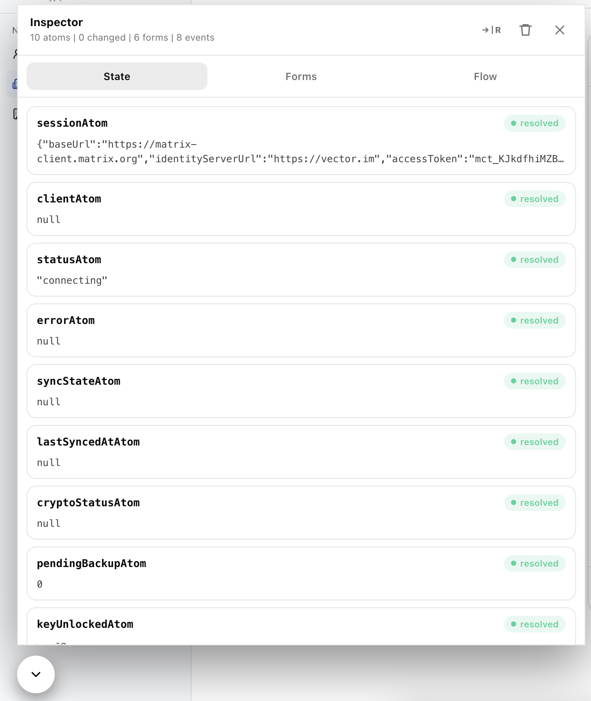
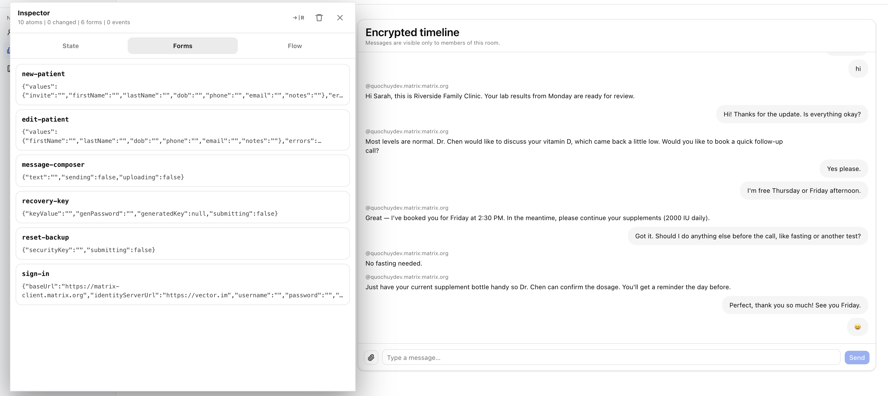
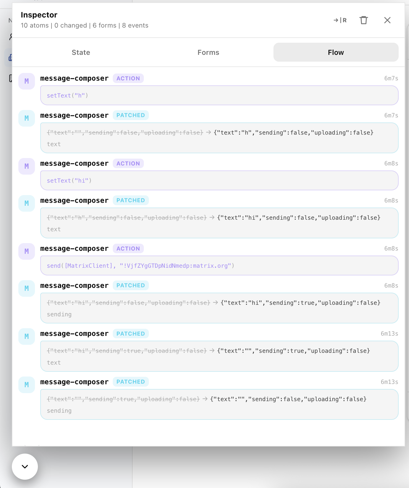

# pumped-devtools

A zero-config, floating **chat-bubble inspector** for [`@pumped-fn/lite-react`](https://www.npmjs.com/package/@pumped-fn/lite-react). Drop it inside a `ScopeProvider` and watch atoms, forms, and the reactive cascade in real time.

Collapsed it's a round button with a change-count badge; expanded it's a resizable panel with three tabs:

**State** — each atom's lifecycle (`idle / resolving / resolved / failed`) and value preview.



**Forms** — each watched `scopedValue` with a change counter (`×n`) and action invocations (`⚡n`).



**Flow** — a chat feed of every transition, newest last, making the reactive cascade visible.



No CSS dependency, owns nothing in your app. UI state (tab, side, size) persists across reloads.

## Usage

```tsx
import { ScopeProvider } from "@pumped-fn/lite-react";
import { PumpedDevtools } from "pumped-devtools";

<ScopeProvider scope={scope}>
  <App />
  <PumpedDevtools
    atoms={{ countAtom, userAtom }} // atoms are nameless → label them
    scopedValues={{ loginForm }} // optional, shown under Forms
    title="my-app"
  />
</ScopeProvider>;
```

> Mount it only in development.

### Props

| prop           | default       | meaning                                                  |
| -------------- | ------------- | -------------------------------------------------------- |
| `atoms`        | —             | `Record<label, Atom>` to watch (required)                |
| `scopedValues` | —             | `Record<label, ScopedValue>` shown under the Forms tab   |
| `title`        | `"pumped-fn"` | panel heading; namespaces the persisted UI state         |
| `side`         | `"left"`      | initial dock corner (`"left"` \| `"right"`)              |
| `size`         | `{384, 560}`  | initial panel size in px — drag the corner to resize     |
| `maxEvents`    | `250`         | flow feed ring-buffer size                               |
| `defaultOpen`  | `false`       | start expanded                                           |
| `scope`        | context       | override the scope instead of reading `ScopeProvider`    |

## Lower-level

`usePumpedFeed(atoms, opts)` returns `{ state, clear }` (atom + form snapshots and flow events) to build your own UI on the same engine. `PumpedFeedStore` is the framework-agnostic core.
